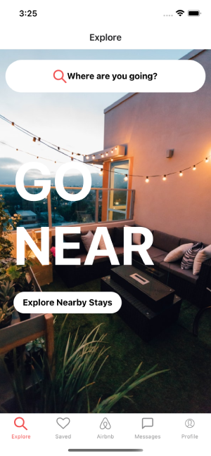
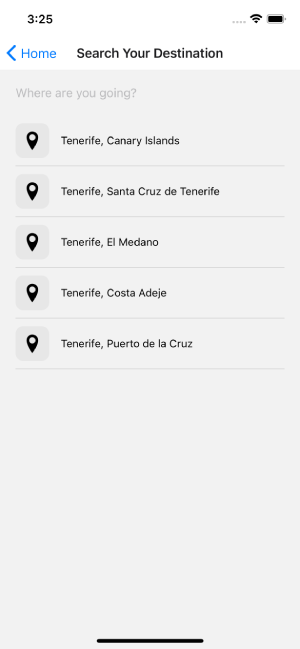
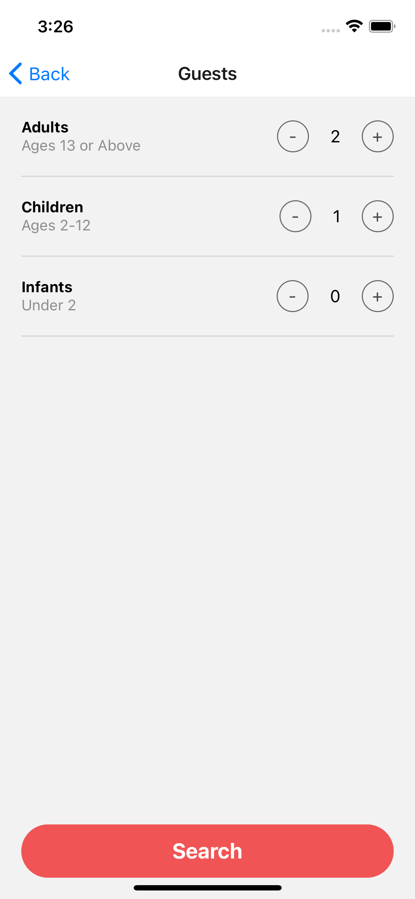

## React Native Airbnb Clone

This repo contains few screens of Airbnb (varied design) and AWS amplify authentication. 

### Screens 
#### Home Screen 

#### Search Destination Screen

#### Guests Option Screen 


### Install
Clone repo, move to project folder and install project dependencies;

```bash
# npm  
npm i
# yarn 
yarn 
```

Then run Project by running below command;

```bash
yarn start
```

Also, initialize ios emulator;

```bash
yarn ios
```